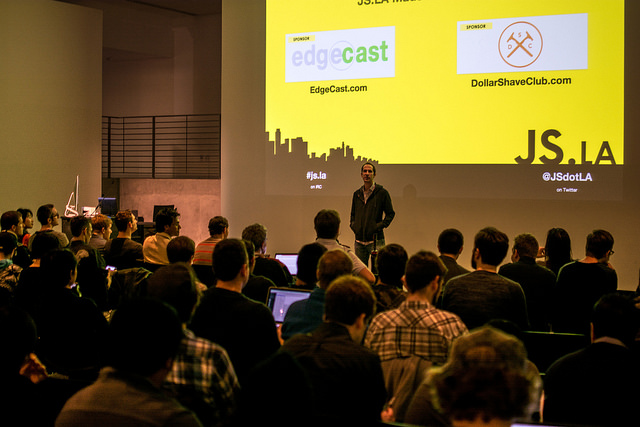
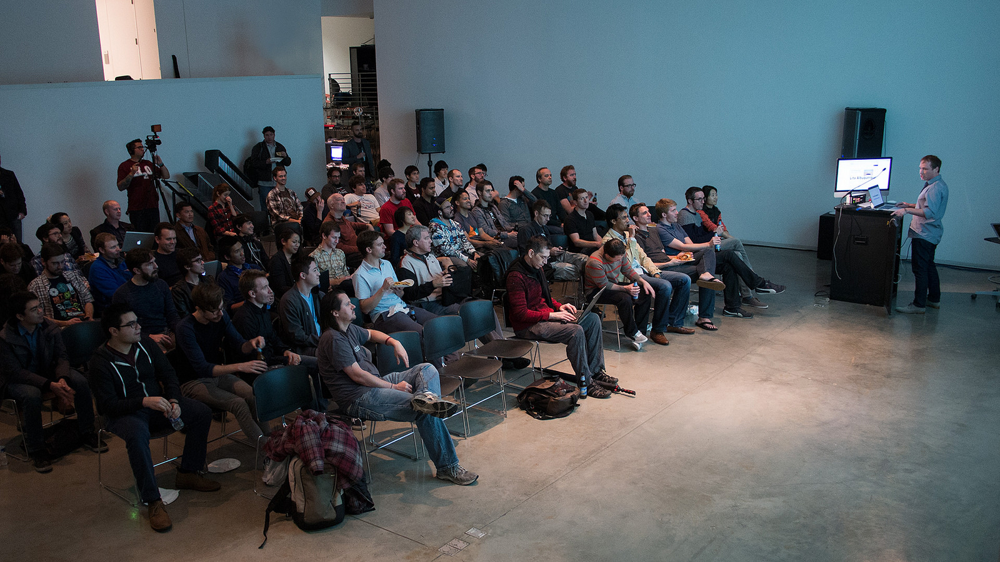
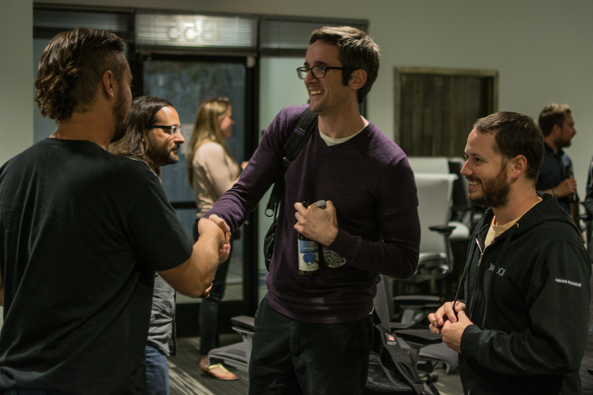
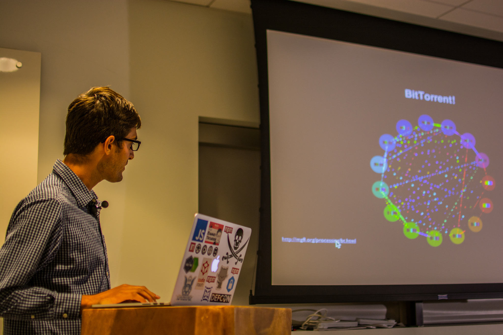
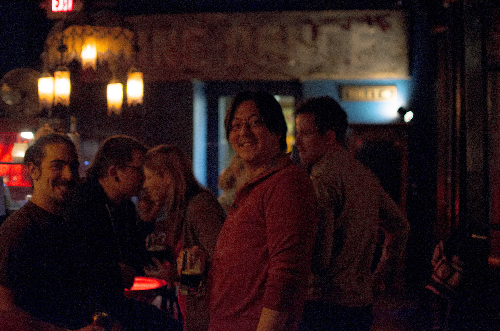

# Running A Successful Local User Group

^ I've internalized and have been iterating on several ideas around leadership and organizing local events for a while now.

^ I know some of you are thinking about this to so I thought I should share some of it with you.

^ I recently relocated to the bay area.

^ When I lived in LA I was one of the organizers of JS.LA. So I am going to use that experience as kind of a case study.

---

# [JS.LA](http://js.la)

A monthly user group focusing on all things JavaScript in Los Angeles

^ If it's not obvious JS.LA is a user group focusing on JavaScript based in Los Angeles.

---

# Successful User Group?

^ More importantly I think it is one of the most loved tech groups in LA.

^ The talk title mentions success, and to me making something people enjoy is what that means. The folks that attend the JSLA events tend to be pretty excited about them.

^ Additionally I think anything that can persists past leadership changes would be considered successful in my book.

^ That means you helped make something other people care about enough to keep going.

---

# ...

^ So why?

^ Why care about or spend time organizing local user groups?

---

# Professional
## Support Group

^ For me it's important to have some kind of professional support group.

^ When you get people that are passionate about a single subject together, some really interesting things start to happen.

^ It can be inspiring and really helpful to bring that diversity of experience back to your day job.

^ This is true for any participant, wether your an organizer or an attendee.

--- 

# Stitch-n-bitch
## It can be helpful to just talk

^ Sometimes we just need to vent about anti-patterns.

^ Sometimes we just need an understanding shoulder to cry on.

^ Sometimes we want to find collaborators.

---

# Craftsmen
## Guild / Union

^ These interactions, the ability to have these passionate and professional conversations around practice and tools are what really separate the craftsmen from the hacks.

^ Speaking candidly about your profession with people you don't work with can be very liberating.

---

# Stay Healthy
## Mix it up

^ I don't mean to make it sound like it's a good idea to be completely immersed in developer culture all the time.

^ It's definitely not.

^ Our industry for some reason can feel like a cult or religion at times. It can be a easy to get your sense of identity wound up pretty tight in very dogmatic things in developer land.

---

Make an effort to keep things diverse and include passionate people.

^ And really if you decide to run or participate in a user group, make an effort to keep it diverse and include very passionate people.

^ If for no other reason than to prevent your own burn out.

---

# So do you want to start a user group?

^ So how do you do this? How do you make it good?

---

# First
## Lets talk about community

---

# Community doesn't "exist"
## You participate in it

^ Really you can replace community with culture in this slide.

---

# Culture doesn't "exist"
## You participate in it

^ There are signals, things like artifacts that point to it.

^ But culture itself is intangible.

---

> an organization's culture is an emergent thing. communicate and collaborate if you want to shape or change it.

- [@sixwing](https://twitter.com/sixwing/status/482601101561044993)

^ Remember, culture is simultaneously cyclical and emergent, 
it takes input and feedback to make things happen.

^ To really have any effect you need to be part of the emergent process.

^ You see community isn't a thing that exists, its a thing you participate in.

---

# YOU NEED TO BE ONE OF US
## Not an opportunist

^ To make it good you have to be one of us.

^ Like I alluded to before, culture is always changing and adapting.

^ As soon as you think you figured it out a it changes.

^ You have to be a willing participant and collaborator. This is different from just being out front or being in charge.

^ You have to care about it.

^ That comes out in the final product and people can feel it, it's visceral.

---

# ONE OF US

^ For me a pre-requisite to being an organizer of a user group is the drive to create an environment you want to participate in.

^ Remember what's good is subjective to your audience and you won't know what that is if your not part of it.

---

# DIY ethic

^ On the topic of visceral participation...

^ When I was younger I was in some awful punk, hardcore bands and used to book a lot of local shows and a few short tours.

^ If I could distill this subculture's ethos down to a three words it would be:

^ do it yourself

---

# DO IT YOURSELF

^ It doesn't have to be perfect, you just have to do it.

^ Learn as you go and iterate from there.

---

## [Temporary Autonomous Zone](http://en.wikipedia.org/wiki/Temporary_Autonomous_Zone)

^ Another aspect of the DIY Ethic is this really beautiful concept:

^ Where any place, I mean literally any physical space can be converted into a community space.

^ You just need the right people, and the right social context.

---

# WAT?

^ I am sure you're wondering what I am even going on about at this point.

^ How does this apply to running a user group?

^ You see LA wasn't known as a tech hub right? I mean you think of LA, and tech isn't the first thing that pops into your head?

---

# There's tech in LA?
## There's tech in [your locale]?

^ I guess LA probably invokes visions of traffic and beaches and movie stars.

^ But all stereo types aside, LA had a pretty sad tech thing going on.

^ Which seems odd since there is some history there. And there are a lot of people.

---

# Your people are not from here

^ I have always had to travel out of town to meet "my" people in the tech world.

^ Usually that was to SF or wherever.

^ And when I told people I was from LA I would get this look like I crawled out of the pre-Mulholland desert.

^ It's just that, I am pretty sure this scenario is similar to yours.

---

# Tech is not just for people with time and access

^ Most likely there are some interesting things happening in your neighborhoods.

^ But the people doing them don't know about conferences like this or have the ability to hop on a plane and show up.

^ If you provide a time and place for them to come together.

^ You'll be surprised what you discover.

^ (Urban Txt) provides a summer program for under privileged minority youth in South Central LA.

---

# Why aren't things better in my town?
## content - leadership - consistency

^ So anyways, a few years ago myself and a co-worker (who runs LA DEV OPS) are having lunch and complaining about the sad state of things.

^ Most of the user-groups were basically full of presentations that could be summarized as "intro to whatever".

^ Some exciting things started popping up around then but they were poorly organized.

^ I mean like people going to the wrong venue or the right venue on the wrong night.

^ (So yeah) over that lunch, we were able to distill the problem to three main missing pieces: content, leadership, consistency

---

# Where are my people?

^ We knew we weren't alone. We just needed to step up and see what we could do.

---

# jsla init

^ I swear, I am not even making this up, that very night John Bender tweeted that he had the js [dot] la domain up for grabs.

^ So we grabbed it! Because it was destiny, right?

^ I'd like to say we struggled a bunch and did all this trial and error but that's not really how it unfolded.

^ It was some work to get the first couple of meet ups set up but after that it was really a practice in efficiency, networking, and communication.

^ So how did we do it? How did we keep it going, how is it still going now?

^ I am going to start with some non-obvious high level ideas first.

---

# Knowing what you don't want isn't enough
## Take the time to really analyze what's missing

^ Saying that meet up was bland lets never have another intro whatever is too simplistic.

^ You have to apply some deeper systems thinking to the problem: 

^ Why was a meet up so bad? Why didn't you like or enjoy it?

---

# Don't ask for permission
## Instead ask for help!

^ If you are starting a Web Components group and notice there is already a JS group you don't need to ask them permission.

^ Additionally if you see there is a defunct group on meet up that hasn't met in a while or ever, don't sweat it.

^ Just go ahead and do your thing.

^ Be polite though. And try not to step on other active group's nights.

^ If there are other groups that focus on the same topic it is nice to give them a heads up and even ask for help, most likely your goals are aligned.

---

# Other local groups are not competition

^ Other local groups are not competition.

^ They are part of your larger eco-system.

^ So be sure to be aware but don't be wary of entering the fray.

---

# Have a clear vision

^ Think long-term about what you are trying to do. Not exactly about who's going to present in 3 months but more like, 

^ How do I want people to feel about this. How do I want to feel about this.

^ Try to formulate a plan to get there, it doesn't have to be exact but you should at least have a solid idea.

^ You need a basis of comparison so you can tell if you are on track.

---

# Content 
## Curate, don't regurgitate

^ Really care about the content and the quality.

---

# [Don't pander to the status quo](https://twitter.com/izs/status/482604709488771074)
## It's a recipe for mediocrity 

^ Be sure not to pander to the status quo.

^ Push things forward, get excited, get inspired.

^ If you don't want to go to your event what makes you think others will?

---

# BUT
## Be responsive to feedback

^ Definitely take into account peoples feedback though.

^ Make sure your doing a good job and find out if your messing up or if you can do anything better.

^ Also use this feedback cycle as a way to get new people involved.	

---

# Don't cater to beginners
## Instead nurture a community that is welcoming

^ Never cater directly to beginners in your main event.

^ I think a lot of people will disagree with this, which is fine. You should experiment with formats.

^ Instead try to nurture an environment that is amenable to newcomers. That means, friendly, outgoing, encourages questions and sudden outbursts.

^ More experienced folks will only tolerate so many boring talks before deciding to never come back.

^ While your beginners will keep coming back even, if they don't quite understand.

^ And usually will start asking questions to the folks around them between talks or over drinks afterwards.

^ For the sake of longevity you will want the more experienced developers frequenting your group.

^ Your pool of local speakers and audience should be close to the same. This keeps the excitement up and can help create a sense of continuity as well as democratize the slide projector.

---

# Blow people's minds
## Or at least try to

---

# Mad Science
## Show people exciting things

^ Instead of intros, get stuff that is out there, more like mad science.

^ Get subjects that the speakers are pumped on, like weekend audio projects using web APIs or whatever, anything that pushes the boundaries.

---

# Remember programming is supposed to be fun

^ Remind people how fun and magical programming can be.

^ After a long day of mashing on the keyboard and sitting in traffic, would you rather learn about how to make a todo app in some new framework or how Feross got bit torrent to work in the browser?

---

# Be excited as an organizer
## Curate things that inspire you

^ Be excited and curate things that inspire you.

^ This is one of the JSLA organizers showing off how he hacked an NES with JavaScript.

^ Using a power glove for extra effect (it still didn't work that good)

---

# Passionate Speakers

^ Get passionate speakers.

^ Sometimes what they are talking about isn't as important as having them talk about something they are pumped on.

^ Pumped speakers are the best, if a speaker is excited it really comes out? It's engaging.

---

# Book speakers in advance
## They can and do cancel, be prepared

^ My favorite trick, is to book speakers about 3 months in advance.

^ This sounds excessive but it allows you some freedom and a back up plan in case things go wrong.

^ Speakers can and do cancel, so be sure to have a backup plan for when this happens. 

^ Let your speakers know that they are in the queue and ask if it's okay to call on them if there is a cancellation.

^ Almost everyone will be cool with this, and I like to think it might light a fire under them to start preparing their talks early :D

---

# Venues
## Don't need to be perfect

^ A venue doesn't have to be prefect, it just has to be the right size and have enough seats.

^ Remember my temporary autonomous zones?

^ If we can turn someones living room into the perfect mosh pit you can make a co-wroking space into the perfect time and place for your user-group.

^ It depends on the format, but nearly any venue will work.

^ Be courteous, it's good to have lasting relationships with venues.

^ That means: help clean up, chase people out after the event, ask if there is anything you can help with.

^ Also be sure that the choice in venue is accommodating to your locale.

^ JSLA has a goal to switch between east and west sides of LA every month.

^ This is nice for the folks who come, because it's hard to get across town in traffic.

---

# Treat venues like sponsors
## Exchange their time and space for something

^ Venues give you time and space, you should give them something in return.

^ Also I would say that you shouldn't pay for space.

^ Find a venue	 that sees value in your groups interests and exchange that value for use of their space.

---

# Don't burn out
## Get help, lots of help.

^ Ask for help

^ Get help from people who have run other groups. It's hard to do all this by yourself. You will need sponsors, a venue, speakers, chairs, whatever...

^ Also ask for help around other things (ice, napkins).

^ Pop in IRC or on twitter.

^ It will save you a ton of stress.

---

# Join Forces

* LA Dev Ops
* Spec.la
* Data Viz LA

^ When JSLA was first getting started we noticed an old meet up group (socaljs) was trying to get rolling again. We ended up joining forces with them instead of having two competing groups.

^ This saved us a lot of work, increased the amount of help we had available and was just better over all.

^ Also we became pretty good friends through the process.

^ The other organizers also have other groups. This means better access to resources. And the ability to combine events when needed (like xmas party type stuff)

---

# Seeking consensus is the enemy of getting things done

^ It's important to get things done.

^ When working with co-organizers it can be hard to get immediate feedback from the others.

^ This can block you from getting anything done in a reasonable amount of time.

---

## Split things up instead

^ Instead be sure to split things up so that one person can be responsible for a single aspect and allow them the space and freedom to get their job done.

^ Some things you need to ask about in order to move forward.

^ If it's mission critical, don't allow the need for consensus block you.

^ Just make a decision and move on.

^ This takes a lot practice to find the right balance but it's worth it.

---

# Have a single, omni-directional information authority

^ Prevent confusion.

^ Intentional or not, don't afford participants the opportunity to garble your message.

^ Things like GH issues and traditional mailing lists are fine but are poor for disseminating information in a clear way.

^ We use a mail chimp newsletter, our website, and twitter feed. 

^ There is a single source of information.

---

# Get sponsors
## Pizza for 80+ people is expensive!

^ Get sponsors, and charge a reasonable amount for sponsorship and be very clear about what you get out of it and what you are going to deliver to your them.

^ Wether thats time in front of the group, toots, or short pitches in the mailing list.

^ Also be consistent with pricing and don't be afraid to charge "too much".

^ Base pricing on what you need to have taken care of (pizza, beer, chair rentals, whatever)

^ Most likely whatever the amount is, it's nominal compared to the marketing and recruiting budgets of even smaller startups.

^ I also think you shouldn't try to make money off the events, if you end up with a balance use it to make things better.

---

## It's okay to have more than one sponsor

^ It's okay to have more than one sponsor, this can allow you to  fly in out of town guests. 

^ This helps with diversity, guest speakers can be the ones you want to bring not just the ones that have corporate sponsors.

---

## Balance sponsors' interests with your audience's

^ Balance value for sponsors with your audience's time and attention.

^ Don't make it feel too pitchy, its good to have the sponsors be participants too.

^ It's more valuable for sponsors to be repeats, this helps with things like branding and presence.

---

# Food and Beverages
## 2 slices and 1.5 beers
## Don't forget water

^ If your doing a thing during the week and it's after work, remember that's dinner time.

^ Be nice, provide some snacks and drinks.

^ This makes logistics for your attendees much simpler.

^ They can just show up instead of having to navigate some unfamiliar neighborhood, foraging for sustenance before your event.

^ And don't forget the water.

---

## Beer is nice but not crucial

^ Beer is nice to have but not crucial, it helps loosen people up.

^ But if you have it, be aware that you are providing a safe environment.

^ There can also be insurance and HR issues so always check with your venue before hand.

---

# (Maybe) Do not use meetup.com
## Or anywhere opportunists lurk

^ I know this might seem counter-intuitive.

^ Generally you should just avoid places where opportunists and recruiters lurk.

^ We have a surprising lack of recruiters, because we avoid places they hang out online (linked.in, meetup.com) and instead spread information via our mailing list, twitter, and our site.

^ This really works.

---

## Recruiters can sometimes be okay though...
### If you are genuinely excited and participating I don't care what your day-job is.

^ We do have recruiters who come but they are different than most, they are learning to code and have this dual purpose in attendance.

^ They aren't just there for the recruiting aspect, they are wanting to learn, being generally excited about the topics, and are friends with lots of people in the group.

---

# But really
## Don't tolerate opportunists

^ Related to the recruiter thing I would say to intentionally remove space from opportunists. Don't allow them room to operate.

^ Don't let random people get in front of the group and pitch their newly hiring startup, or hot new product or whatever.

^ Tell them they can sponsor and get in the agenda next time, but don't allow random people try extract value from your group without putting in something in in return.

---

# Be consistent
## Don't be confusing.

^ It's important to be consistent for a lot of reasons, mostly so that you are not confusing to your audience.

^ I don't have a lot to say about this except that it is really, really important.

---

# Don't loose your mind
## It's easy to burn out

^ When planning a recurring event like a user-group it is really helpful to stay organized.

^ Relates to asking for help, don't be afraid to delegate.

---

# Produce Artifacts

^ Record video, take pictures.

^ We record videos of the talks.

^ Quality doesn't mater as much as having an archive.

^ When people find you for the first time they can look at that and know what they are getting into.

^ Sponsors can check it out and realize your not just some random thing.

^ And speakers can get a sense of the kinds of topics already presented.

^ Get help with this, open it up to everyone.

^ Use something like vimeo, youtube, flikr. Make sure your content is sharable and accessible.

---

# Provide Extra Time and Space
## Drinks.js

^ Thanks to David Guttman we shortened the length of JSLA to two 20 min talks.

^ And then try to get as many people in the group to walk over to a neighboring bar so they can mingle and get to know each other.

^ This is actually where a lot of talk proposals pop up, and is a perfect opportunity to chase some constructive feedback.

^ Sometimes people have to work late but they still make it to the drinks portion.

^ This is really where the whole community aspect comes in, this is where folks get to know each other and all the great things they work on.

^ Try to find a quite bar too, we have mad the mistake of walking into the wrong bar and it's just not that fun...

---

# If you build it they will come

^ The DIY punk stuff I mentioned earlier taught me to book your own shows, find your own venues, put out your own records.

^ This is true for things in our community too.

^ How you do something isn't as important as just getting out there and doing it.

---

# Thanks
- @jxson
- jasoncampbell@google.com

### js.la contact info
- hello@js.la
- @jsdotla

^ Okay thanks

^ Come find me if you want to chat.
